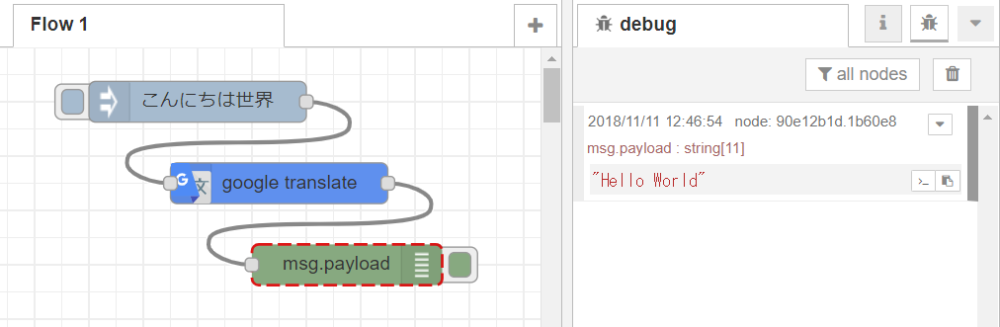
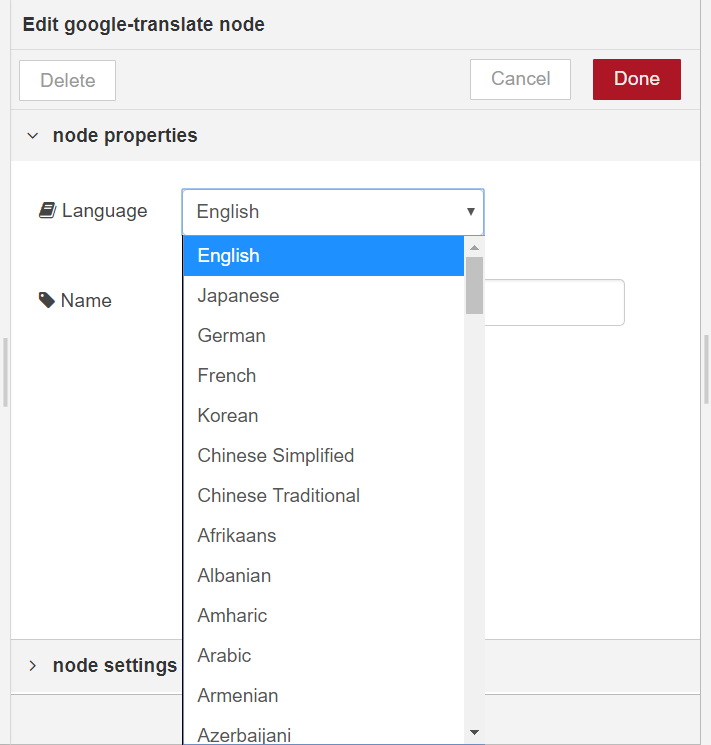

# node-red-contrib-google-translate
Node-RED node for Google Translate

Install
-------
Run the following command in your Node-RED user directory - typically `~/.node-red`

        npm install node-red-contrib-google-translate

Example
-------
String data in msg.payload will be translated into language specified in node property.

More than 100 languages are supported in the Google Translate node.

